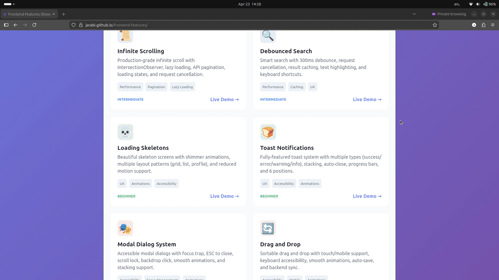
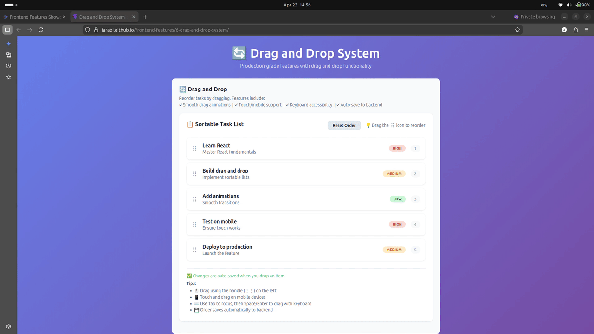

# Frontend Features

Building production-grade frontend features requires attention to performance, accessibility, error resilience, and a smooth user experience. Below is a structured roadmap that walks you through each feature, explaining the core concepts, step‑by‑step implementation strategies, and the production‑grade considerations you must master.

[Live Demo](https://jarabi.github.io/frontend-features/)

**Frontend Features Demo**

    <video src="showcase.mp4" 
        width="100%" 
        autoplay 
        loop 
        muted 
        playsinline>
    </video>

## Table of Content

* [1. Infinite Scrolling](#1-infinite-scrolling)
    + [Core Concepts](#core-concepts)
        - [Implementation Steps](#implementation-steps)
        - [Production‑Grade Considerations](#production-grade-considerations)
* [2. Debounced Search](#2-debounced-search)
    + [Core Concepts](#core-concepts-1)
        - [Implementation Steps](#implementation-steps-1)
        - [Production‑Grade Considerations](#production-grade-considerations-1)
* [3. Search + Infinite Scroll + Loading Skeletons](#3-search--infinite-scroll--loading-skeletons)
    + [Core Concepts](#core-concepts-2)
        - [Implementation Steps](#implementation-steps-2)
        - [Production‑Grade Considerations](#production-grade-considerations-2)
* [4. Toast Notifications](#4-toast-notifications)
    + [Core Concepts](#core-concepts-3)
        - [Implementation Steps](#implementation-steps-3)
        - [Production‑Grade Considerations](#production-grade-considerations-3)
* [5. Modal Dialogs](#5-modal-dialogs)
    + [Core Concepts](#core-concepts-4)
        - [Implementation Steps](#implementation-steps-4)
        - [Production‑Grade Considerations](#production-grade-considerations-4)
* [6. Drag and Drop](#6-drag-and-drop)
    + [Core Concepts](#core-concepts-5)
        - [Implementation Steps](#implementation-steps-5)
        - [Production‑Grade Considerations](#production-grade-considerations-5)
- [General Production‑Grade Principles for All Features](#general-production-grade-principles-for-all-features)
- [Learning Path Suggestion](#learning-path-suggestion)

## 1. Infinite Scrolling

### Core Concepts

- **Intersection Observer API**: Modern, performant way to detect when elements enter the viewport
- **Sentinel element**: Invisible element at the bottom that triggers loading when visible
- **Request cancellation**: Abort in-flight requests using AbortController
- **Error handling**: Display error messages with manual retry option
- **Loading states**: Visual feedback during data fetching and completion detection

#### Implementation Steps

1. **Set up Intersection Observer**
    - Create observer watching a sentinel element at the bottom of the list
    - Configure threshold (0.1) and rootMargin (100px) for preloading
    - Trigger data fetch when sentinel becomes visible

2. **Fetch paginated data**
    - Maintain page state and increment on each load
    - Use AbortController to cancel previous requests
    - Append new items to existing list without replacement

3. **Handle loading states**
    - Show loading spinner while fetching
    - Display error message with retry button on failure
    - Show completion message when all data is loaded

#### Production‑Grade Considerations

- **Intersection Observer benefits**: Native async API, doesn't block main thread, better performance than scroll listeners
- **Request cancellation**: Prevents race conditions and out-of-order responses
- **Error resilience**: User-friendly error messages with manual retry capability
- **Performance**: Preload data 100px before sentinel enters viewport
- **Accessibility**: Proper ARIA labels and screen reader announcements
- **Edge cases**: Handle empty initial state, network failures, and end-of-data detection

#### Demo & Screenshot

[Live Demo](https://jarabi.github.io/frontend-features/1-infinite-scroll/)

## 2. Debounced Search

### Core Concepts

- **Debounce**: Delay API calls until the user stops typing (300ms default)
- **Request cancellation**: Abort in-flight requests using AbortController
- **Result caching**: Cache search results per query and page to avoid redundant requests
- **Query history**: Display recent cached searches in the UI
- **Keyboard shortcuts**: `Ctrl+K`/`⌘K`, `/`, and `Esc` for search interaction
- **Infinite scroll**: Automatic pagination for search results
- **Text highlighting**: Safe highlighting of matched search terms

#### Implementation Steps

1. **Implement debounced search**
    - Bind input event with 300ms debounce delay
    - Use AbortController to cancel previous requests
    - Cache results per query and page combination

2. **Add keyboard shortcuts**
    - `Ctrl+K`/`⌘K` and `/` to focus search input
    - `Esc` to clear search and reset to default feed
    - Global keydown listener for accessibility

3. **Display query history**
    - Extract cache keys to show recent searches
    - Allow clicking history items to re-run searches
    - Maintain history state across sessions

4. **Handle infinite scroll for search**
    - Use Intersection Observer for pagination
    - Maintain separate page state for search vs. default feed
    - Append new results to existing search results

#### Production‑Grade Considerations

- **Debounce timing**: 300ms balances responsiveness with API efficiency
- **Request deduplication**: Cancel previous requests to prevent race conditions
- **Caching strategy**: Cache per query/page prevents redundant API calls
- **Keyboard accessibility**: Global shortcuts improve UX for power users
- **Text highlighting**: Safe implementation prevents XSS attacks
- **State management**: Separate state for search vs. default feed modes

#### Demo & Screenshot

[Live Demo](https://jarabi.github.io/frontend-features/2-debounced-search/)

## 3. Search + Infinite Scroll + Loading Skeletons

### Core Concepts

- **Combined features**: Debounced search, infinite scroll pagination, and contextual loading skeletons
- **Multiple layout types**: Blog cards, dashboard stats, product pages, and social feeds
- **Shimmer animations**: CSS-based gradient animations that match final content structure
- **Layout switching**: Toggle between different UI layouts to see appropriate skeleton states
- **LRU caching**: Bounded cache with least-recently-used eviction for search results

#### Implementation Steps

1. **Debounced search with caching**
    - 300ms debounce delay before API calls
    - Cache search results per query and page
    - Display cached query history in UI

2. **Infinite scroll with Intersection Observer**
    - Automatic pagination when scrolling to bottom
    - Request cancellation for stale requests
    - Append new items to existing results

3. **Contextual skeleton loading**
    - Design skeletons that match each layout's visual hierarchy
    - Show skeletons during initial load and subsequent fetches
    - Seamless transition from skeleton to real content

4. **Layout switching**
    - Toggle between blog, dashboard, product, and social feed layouts
    - Each layout has its own skeleton component
    - Maintain search and scroll state across layout changes

#### Production‑Grade Considerations

- **Skeleton consistency**: Match skeleton dimensions to real content to prevent layout shifts
- **Cache management**: Implement LRU eviction with configurable max entries (default: 20)
- **Keyboard accessibility**: `Ctrl+K`/`⌘K`, `/`, and `Esc` shortcuts for search interaction
- **Text highlighting**: Safe highlighting of search terms in results
- **Request deduplication**: Cancel previous requests when new searches are triggered
- **Performance**: Use CSS-only shimmer animations, avoid JavaScript animations

#### Demo & Screenshot

[Live Demo](https://jarabi.github.io/frontend-features/3-search-scroll-skeletons/)

## 4. Toast Notifications

### Core Concepts

- **Multiple toast types**: Success, error, warning, info with distinct icons and colors
- **Auto-close with timeout**: Configurable duration with progress indication
- **Manual close**: Close button on each toast for immediate dismissal
- **Stacking and positioning**: 6 different positions with intelligent stacking
- **Smooth animations**: Enter/exit transitions with accessibility considerations
- **Context-based API**: React Context for global toast management
- **Timeout management**: Proper cleanup to prevent memory leaks
- **Accessibility**: ARIA roles, keyboard navigation, screen reader support

#### Implementation Steps

1. **Set up React Context**
    - Create ToastContext with provider and custom hook
    - Manage toast state with add, remove, and clear functions
    - Separate component exports from non-component code for Fast Refresh

2. **Create toast components**
    - Individual Toast component with type-specific styling
    - ToastContainer for positioning and stacking
    - Progress bar for auto-close indication

3. **Implement timeout management**
    - Use Map to store timeout IDs for each toast
    - Proper cleanup in removeToast, clearAllToasts, and unmount
    - Prevent memory leaks with useRef and cleanup functions

4. **Add positioning and stacking**
    - Support 6 positions: top/bottom-left/center/right
    - Vertical stacking with proper spacing
    - Maximum toast limits to prevent overflow

#### Production‑Grade Considerations

- **Memory leak prevention**: Proper timeout cleanup using Map-based storage
- **Fast Refresh optimization**: Separate component and non-component exports
- **Accessibility**: Full ARIA support, keyboard navigation, reduced motion respect
- **Performance**: Minimal re-renders with proper memoization
- **Mobile responsiveness**: Touch-friendly sizing and safe area support
- **TypeScript ready**: Proper interfaces and type safety
- **Promise support**: Toast promises for async operation feedback

#### Demo & Screenshot

[Live Demo](https://jarabi.github.io/frontend-features/4-toast-notifications/)

## 5. Modal Dialogs

### Core Concepts

- **Stacked modal provider**: Manage multiple open modals as a stack with a single shared provider
- **Focus trap**: Keep keyboard focus inside the active modal and skip disabled/hidden elements
- **Esc to close**: Close the top modal with `Escape`, unless explicitly disabled
- **Outside click**: Configurable backdrop close behavior per modal
- **Scroll lock**: Prevent background scrolling while any modal is open
- **Exit animation**: Delay unmount until fade-out / slide-down transitions complete
- **Focus restoration**: Return focus to the trigger element after the modal closes
- **Accessibility**: `role="dialog"`, `aria-modal="true"`, proper focus behavior and labels
- **Responsive**: Modal content adapts to smaller screens and internal scrolling
- **Pure React**: No external modal libraries required

#### Implementation Steps

1. **Modal provider & context**
    - Use `ModalProvider` to store modal configs and stack order.
    - Expose `openModal`, `closeModal`, `closeTopModal`, and `closeAllModals` via `useModal()`.

2. **Render modal stack**
    - Use `ModalContainer` to render each modal entry from context.
    - Keep each modal in the DOM until its exit animation finishes.

3. **Focus trapping**
    - On open, focus the modal container and remember the previous active element.
    - Trap Tab / Shift+Tab navigation inside the active modal.
    - Exclude disabled controls and `aria-hidden="true"` elements from the focus set.

4. **Keyboard shortcuts**
    - Close top modal on `Escape` when allowed.
    - Ensure only the top modal is affected in stacked scenarios.

5. **Backdrop and outside click**
    - Close the modal when the user clicks the overlay, if `closeOnOutsideClick` is enabled.
    - Ignore clicks inside the modal content.

6. **Scroll lock**
    - Manage `document.body.style.overflow = 'hidden'` while any modal is open.
    - Restore the original overflow value when the final modal closes.

7. **Exit animation handling**
    - Use an `isClosing` flag instead of immediately unmounting.
    - Apply `-exit` CSS classes to overlay and container.
    - Call `onClose(id)` only after the transition completes or a matching timeout.

#### Production‑Grade Considerations

- **Accessibility**:
    - Support screen readers with `role="dialog"`, `aria-modal="true"`, and meaningful titles.
    - Restore focus to the opening trigger element after close.
    - Ensure keyboard navigation remains trapped inside the active modal.

- **Animation timing**:
    - Keep entrance and exit durations consistent between CSS and JS delays.
    - Provide reduced-motion support if needed.

- **Stacked modals**:
    - Manage only the top modal for ESC and outside-click closing.
    - Keep earlier modals in the DOM while stacked.

- **Responsiveness**:
    - Use max-widths and internal scroll for large content.
    - Ensure the modal remains usable on phones and tablets.

- **Clean cleanup**:
    - Clear any close timers on unmount.
    - Remove global event listeners and restore focus reliably.

- **Testing**:
    - Validate tab order and focus trapping.
    - Test closing via button, ESC, and backdrop click.
    - Verify scroll lock and focus restoration across stacked modals.

#### Demo & Screenshot

[Live Demo](https://jarabi.github.io/frontend-features/5-modal-dialog-system/)

## 6. Drag and Drop

### Core Concepts

- **@dnd-kit library**: Modern, accessible drag-and-drop with modular components (core, sortable, utilities)
- **Drag handle**: Dedicated grab handle with visual indicator for initiating drags
- **Visual feedback**: Opacity changes, shadow enhancement, and transform effects during drag
- **Ghost image**: Custom drag overlay with elevated styling during drag operation
- **Mobile support**: Touch events with activation constraint (8px) to prevent accidental drags
- **Keyboard accessibility**: Full keyboard navigation with Space/Enter to grab, arrow keys to reorder
- **Auto-save**: Automatic backend sync on drop via API call
- **Error handling**: Toast notifications for load, save, and reset failures
- **Loading states**: Initial load spinner and saving indicators
- **Reduced motion**: Respects `prefers-reduced-motion` for users who prefer no animations

#### Implementation Steps

1. **Set up dnd-kit**
    - Wrap with `DndContext` using `closestCenter` collision detection
    - Use `SortableContext` with `verticalListSortingStrategy` for list items
    - Implement `useSortable` hook on each draggable item

2. **Create draggable items**
    - Use `useSortable` hook to get `transform`, `transition`, `isDragging` properties
    - Apply inline styles from `CSS.Transform.toString(transform)`
    - Add `dragging` class for visual feedback (opacity: 0.5, enhanced shadow)

3. **Add drag handle**
    - Separate button element with `drag-handle` class
    - Bind `attributes` and `listeners` from `useSortable` to the handle
    - Add `aria-label="Drag to reorder"` for accessibility

4. **Handle drag end**
    - Calculate new index from `active` and `over` sensors
    - Reorder array using splice operations
    - Trigger auto-save to backend via `saveOrder` API

5. **Add keyboard support**
    - dnd-kit provides keyboard sensors automatically
    - Space/Enter to grab, arrow keys to move, Space/Enter to drop
    - Focus visible styles on interactive elements

6. **Implement loading and error states**
    - Show spinner during initial load and on save
    - Wrap async operations in try/catch
    - Display toast notifications on failures

#### Production‑Grade Considerations

- **Accessibility**:
    - Keyboard navigation with Space/Enter to grab and arrow keys to reorder
    - ARIA labels on drag handles (`aria-label="Drag to reorder"`)
    - Focus visible styles on buttons and modals
    - Screen reader support via `role="list"` and proper labels

- **Performance**:
    - Use CSS `transform` for smooth dragging (GPU accelerated)
    - Avoid layout thrashing with throttled event handlers
    - Minimal re-renders with proper React optimization

- **Visual feedback**:
    - Hover transform on non-dragging items only (`:hover:not(.dragging)`)
    - Enhanced shadow during drag operation
    - Smooth CSS transitions for all interactive states

- **Error resilience**:
    - Toast notifications for all async failures (load, save, reset)
    - Error messages include fallback text for missing error details
    - Loading states prevent double-submissions

- **Reduced motion**:
    - CSS transitions disabled via `prefers-reduced-motion: reduce`
    - Progress bar animations disabled for toasts
    - Focus outline animations simplified

- **Testing**:
    - Test drag operations with mouse and touch inputs
    - Verify keyboard navigation works correctly
    - Test error scenarios and toast display

#### Demo & Screenshot

[Live Demo](https://jarabi.github.io/frontend-features/6-drag-and-drop-system/)

#### General Production‑Grade Principles for All Features

- **Error Handling**: Always display user‑friendly errors, log details to an error tracking service (Sentry, etc.), and provide retry mechanisms where appropriate.

- **Accessibility**: Test with screen readers, ensure keyboard navigation works, and use semantic HTML and ARIA attributes.

- **Performance**: Minimize re‑renders, use virtualization for long lists (e.g., react-window), and lazy load components/code.

- **Testing**:
    - Unit tests for logic (e.g., debounce, scroll detection).
    - Integration tests for user flows (e.g., search → results → infinite scroll).
    - End‑to‑end tests for critical paths.
- **Responsive Design**: Ensure all features work on mobile, tablet, and desktop, with touch and mouse inputs.
- **Documentation**: Write clear comments and maintain a style guide for your components so they remain reusable and maintainable.

#### Learning Path Suggestion

1. Start with a simple UI library (React, Vue, Svelte) or vanilla JavaScript.
2. Implement each feature step by step, first without advanced optimizations.
3. Gradually add production features: error handling, accessibility, request cancellation, and performance tweaks.
4. Use TypeScript to catch type errors early.
5. Write tests for each feature.
6. Finally, combine them into a real‑world application (e.g., a dashboard with a searchable, sortable, paginated list, modals, and toasts).

By following this roadmap, you’ll not only learn how to build each feature individually but also how to integrate them into a cohesive, robust frontend application.